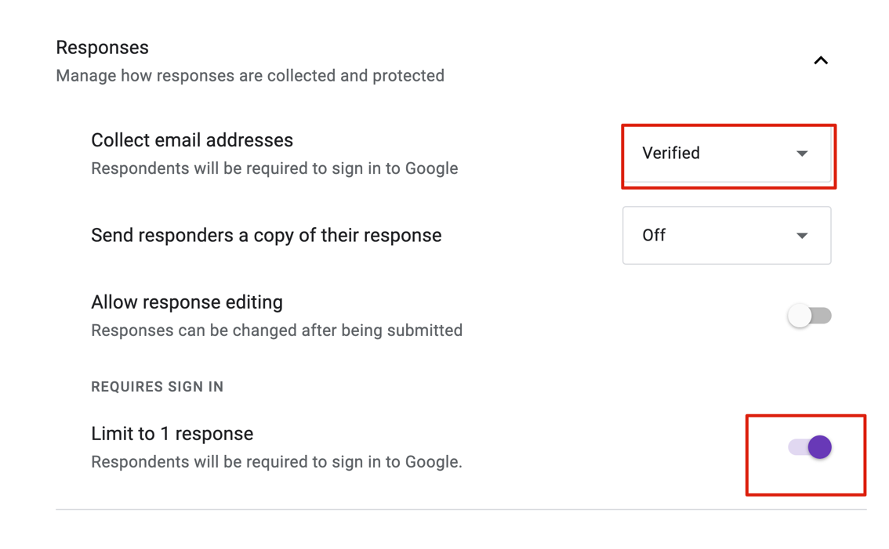
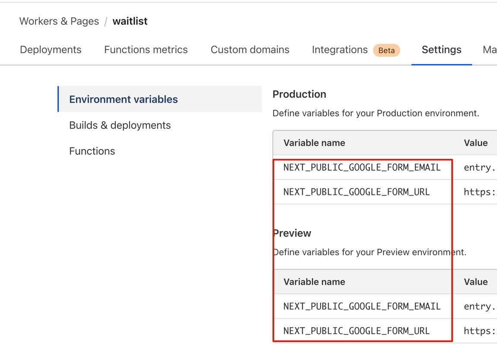
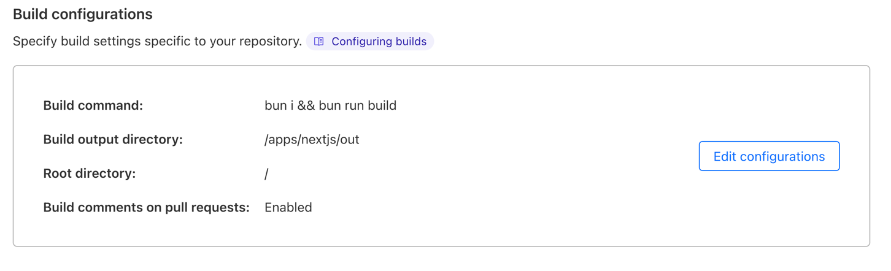
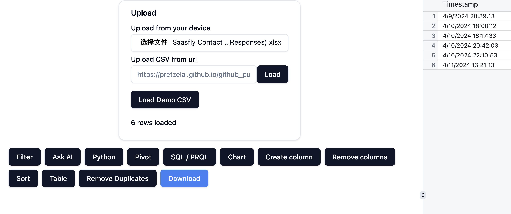

# Empower Your AI Startup with a  Waitlist

Kickstart your AI startup journey with a waitlist instead of a SaaS template. Once you've completed your waitlist, check out our AI-powered Next.js SaaS template [Saasfly](https://github.com/saasfly/saasfly).

## Why Choose Saasfly Waitlist?

1. **High-Performance Static Pages**: Leveraging Next.js's static site generation (SSG) capabilities, deliver blazing-fast static pages while enjoying Next.js's unparalleled development experience.
2. **Zero Hosting Costs**: Deploy static pages on Cloudflare completely free of charge, eliminating hosting costs and concerns.
3. **Dynamic Data Collection**: Harness the power of Google Forms to collect form data, empowering static pages with dynamic capabilities for seamless data collection and user interaction.
4. **Data Ownership and Privacy**: Maintain full control and ownership of your data without relying on third-party SaaS providers, ensuring data privacy and autonomy.
5. **Powerful Data Analysis**: Utilize a simple yet effective local-first analysis [service](https://excel.saasfly.io/) to gain valuable insights from your collected data. This lightweight tool empowers you to make data-driven decisions without the need for complex and costly BI systems, while keeping your data secure and under your control.

> **Nextify** offers complete enterprise-grade SaaS solutions. If you're interested in discussing your project or just want to connect with us, feel free to reach out at contact@nextify.ltd.

> ❤️ We **provide free technical support and deployment services for non-profit organizations**.

> 🙌 **All profits we gain from open-source projects will be entirely used to support open-source initiatives and charitable causes**.

## Introduction

Our goal is to leverage Next.js's static site generation (SSG) capabilities to build a high-performance waiting list page, and use Google Forms as the backend to receive user-submitted email information. With this approach, we can quickly and cost-effectively create a waiting list page without having to write any backend code for data collection.

## ⚡ Live Demo

Try it out for yourself!

Demo URL: https://waitlist.saasfly.io

## ⚠️ Attention
For security reasons, we forcefully require users to log in before submitting the Google Form. You can turn off this requirement in the test environment or if your use case doesn't need this level of security.



## 🚀 Quick Start

### 📋 Prerequisites

Before getting started, make sure you have the following installed:

1. Bun & Node.js & Git

- Linux

```bash
curl -sL https://gist.github.com/tianzx/874662fb204d32390bc2f2e9e4d2df0a/raw -o ~/downloaded_script.sh && chmod +x ~/downloaded_script.sh && source ~/downloaded_script.sh
```

- MacOS

```bash
/bin/bash -c "$(curl -fsSL https://raw.githubusercontent.com/Homebrew/install/HEAD/install.sh)"
brew install git
brew install oven-sh/bun/bun
brew install nvm
```

### Installation

To start using this template, follow these steps:

1. Clone the repository:

```bash
git clone https://github.com/saasfly/waitlist.git
cd waitlist
bun install
```

2. Set up environment variables:

```bash
cp .env.example .env.local
```
See our [documentation](https://document.saasfly.io/usage/waitlist/google-forms/) to learn how to get your own variables.

3. Run the development server:

```bash
bun run dev
```

4. Open http://localhost:3000 in your browser to see the result.

## ⭐ Features

- **🐭 Framework**: Next.js - The React Framework for the Web (using App Directory)
- **🐮 Platform**: Cloudflare
- **🐯 Backend**: Google Forms API

## 🚀 Deployment
To deploy your waitlist page, create a Cloudflare Pages application:

1. Add your own variables



2. Deploy config



## 🤔 Analysis
You don't need a very complex BI system. I build a simple local-first excel analysis [service](https://excel.saasfly.io) to help you.


## 📜 License
This project is licensed under the MIT License. For more information, see the [LICENSE](LICENSE) file.